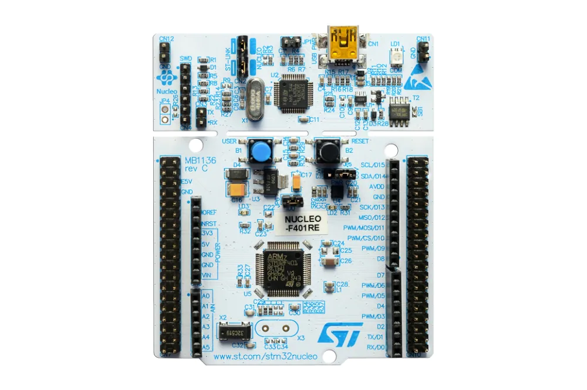

# Practica 3 - PdM

**Tabla de contenidos**
- [Practica 3 - PdM](#practica-3---pdm)
  - [Plataforma de desarrollo](#plataforma-de-desarrollo)
  - [Objetivo](#objetivo)
    - [Consigna](#consigna)
  - [Ubicacion y archivos de los drivers](#ubicacion-y-archivos-de-los-drivers)
  - [Modificar tiempo de leds](#modificar-tiempo-de-leds)
  - [Funciones implementadas](#funciones-implementadas)
    - [Nota](#nota)
  - [Variables implementadas](#variables-implementadas)
    - [1. tick\_t](#1-tick_t)
    - [2. bool\_t](#2-bool_t)
    - [3. delay\_t](#3-delay_t)
    - [4. ledConf\_t](#4-ledconf_t)
  - [Autor](#autor)

## Plataforma de desarrollo


Compilado y probado para la placa de desarrollo **NUCLEO-F401RE**

*STM32F401RE Embedded Nucleo STM32F4 MCU 32-Bit ARM Cortex-M3 Evaluation Board*

**NOTA:** Para esta practica, al poseer la placa un solo LED, se utilizaron las salidas **GPIO_PIN_7** y **GPIO_PIN_6** para el manejo de los 2 led restantes.

## Objetivo
* Encapsular las funciones necesarias para usar retardos no bloqueantes en un archivo fuente API_delay.c con su correspondiente archivo de cabecera API_delay.h, y ubicar estos archivos en la carpeta API creada.
  
* Crear una carpeta API dentro de la carpeta Drivers en la estructura de directorios del nuevo proyecto. Crear dentro de la carpeta API, subcapetas /Src y /Inc.

### Consigna
Implementar un programa que utilice retardos no bloqueantes y  haga titilar en forma periódica e independiente los tres leds de la placa NUCLEO-F429ZI de la siguiente manera:
- LED1: 100 ms. 
- LED2: 500 ms.
- LED3: 1000 ms.

## Ubicacion y archivos de los drivers
```bash
├───Core
│   ├───Inc
│   ├───Src
│   └───Startup
└───Drivers
    ├───API
    │   ├───Inc     <--- API_delay.h
    │   └───Scr     <--- API_delay.c
    ├───CMSIS
    └───STM32F4xx_HAL_Driver
```
## Modificar tiempo de leds
Para modificar los tiempo de encendido de los led se deben modificar los #define ubicados en main.c

```C
#define LED1_DURATION 100
#define LED2_DURATION 500
#define LED3_DURATION 1000
```

## Funciones implementadas

```C
void delayInit( delay_t * delay, tick_t duration );
bool_t delayRead( delay_t * delay );
void delayWrite( delay_t * delay, tick_t duration );
```

### Nota
Se implemento un manejador de errores en el modulo **API_delay.c** que en caso de falla se queda en un loop infito *while(1)*.

```C
static void Error_Handler(void)
{
  __disable_irq();
  while (1){
  }
}
```

## Variables implementadas
### 1. tick_t
```C
typedef uint32_t tick_t;
```
**Qué biblioteca se debe incluir para que esto compile?**
La libreria *<stdlib.h>*

### 2. bool_t
```C
typedef bool bool_t;
```
**Qué biblioteca se debe incluir para que esto compile?** La libreria *<stdbool.h>*
	
### 3. delay_t
```C
typedef struct{
    tick_t startTime;
    tick_t duration;
    bool_t running;
} delay_t;
```
Contiene todos los datos necesarios para el manejo del delay

### 4. ledConf_t
```C
typedef struct{
    uint16_t pin;
    GPIO_TypeDef *port;
    delay_t *delay;
} ledConf_t;
```
Concatena todas las variables necesarias para el manejo de los led con sus respectivos puertos y tiempos de delay. Util para implementar loops y modificar variables en un solo lugar en el codigo

## Autor

Ing. Fernando Nicolas Calvet

@FCalvet